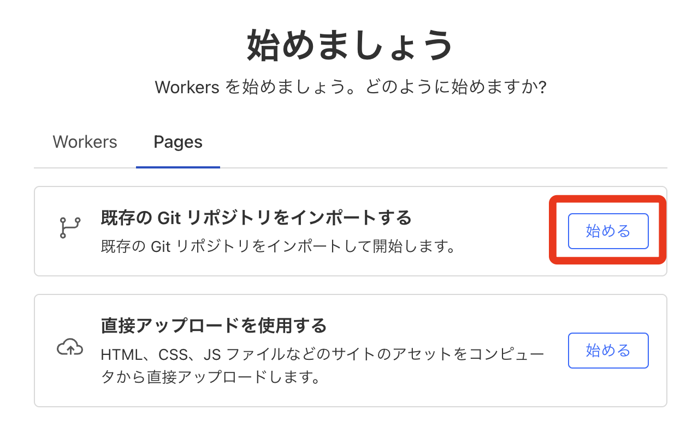

## 前置き
初めて自分のWebアプリケーションを公開します。まずは無料で公開できる方法ということでCloudflare Pagesを使うことにしました。出来上がったページはこちらです！
https://mychaptertube.pages.dev/


### やりたいこと
Next.jsで作ったプロジェクトをcloudflare pagesに公開する。

### 制約事項
無料プランで公開する。

### 前提条件
- Next.jsのプロジェクトは作成済み。
    - プロジェクトはGitHubにpush済み。
    - プロジェクトにはフロントエンドのみが含まれ、バックエンドは含まれていない。
- Cloudflareのアカウントは持っていない。

## 手順
### Cloudflareアカウントの作成
[Cloudflareの公式サイト](https://www.cloudflare.com/)にアクセスし、無用プランでアカウントを作成した。今回はGoogleアカウントと連携させる形にした。

### プロジェクトを静的サイトとしてエクスポート
Cloudflare Pagesの無料プランではNext.jsプロジェクトを予め静的ファイルにエクスポートしておく必要がある。

1. Next.jsプロジェクトフォルダ内のnext.config.tsを開き、以下の設定を追加する。
この設定は`npm run export`や`next export`を実行し、ビルド済みのアプリケーションを静的ファイルとして出力する工程で適用される。ビルドは`npm run buid`や`next buid`で行う。
```ts {4-5} title="/next.config.ts"
import type { NextConfig } from "next";

const nextConfig: NextConfig = {
  output: 'export',      // ビルド時に静的エクスポートする
  trailingSlash: true,   // （必要に応じて）末尾にスラッシュを付与
};

export default nextConfig;
```
2. ローカルで動作確認
下記コマンドを実行しローカルで動作確認を行う。プロジェクト直下にout/ディレクトリが作成されていることを確認する。
```bash
npm install
npm run build
# -> OKだったので次に進む
```

3. GitHubにプッシュ
この状態でGitHubにプッシュする。

### Cloudflare Pagesにプロジェクトを接続 
1. Cloudflareのダッシュボードの左側パネルから、コンピューティング(Workers) -> Workers & Pages をクリックする。
2. 表示されるページ上でPagesタブをクリックし、「既存のGitリポジトリをインポートする」で始めるボタンをクリックする。

3. アカウントからサイトをデプロイする画面でGitHubに接続ボタンを押す。GitHubと連携画面に遷移しInstall & Authorize Cloudflare Workers and Pagesという設定ページに移る。Only select repositoriesを選んでInstall & Authorizeする。最後に「セットアップの開始」ボタンを押す。
4. プロジェクト名を設定し、プロダクションブランチをmainとした。ビルドの設定は下記の通り:
    | 項目                | 値                 |
    | ------------------- | ---------------- |
    | Framework preset    | Next.js          |
    | Build command       | `npx next build` |
    | Build output folder | `out`            |
    | Root directory      | frontend         |
  Next.jsプロジェクトをリポジトリ直下ではなくfrontendフォルダで作成していたためルートディレクトリを設定した。環境変数は使用していないので設定していない。
  
  ### プロジェクトのデプロイ
 Cloudflare Pagesのダッシュボードでデプロイボタンをクリックした。

  :::note[Next.jsのバージョンとデプロイスクリプトの対応]
  最初に上記手順でデプロイしようとしたところ、Cloudflare上でのアプリケーションのビルドに失敗した。
  エラーメッセージはこれ。
  ```log {2}
  16:49:18.749	Executing user command: npx next build
  16:49:19.594	You are using Node.js 18.17.1. For Next.js, Node.js version "^18.18.0 || ^19.8.0 || >= 20.0.0" is required.
  16:49:19.608	Failed: Error while executing user command. Exited with error code: 1
  16:49:19.617	Failed: build command exited with code: 1
  16:49:20.599	Failed: error occurred while running build command
  ```
  Cloudflare pagesのビルド環境がデフォルトでNode.js v18.17.1を使っているが、私が使用したNext.js v15では`^18.18.0 || ^19.8.0 || >=20.0.0`を要求している。したがって、ビルドに使用するNode.jsのバージョンを明示的に指定することで解決する。具体的には、プロジェクトフォルダ（今回はfrontend）直下に`.nvmrc`ファイルを配置し`18.18.0`と設定した。
  :::